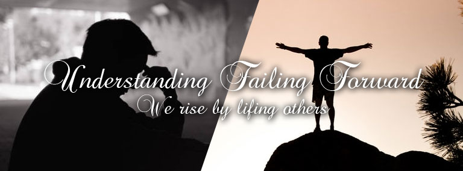
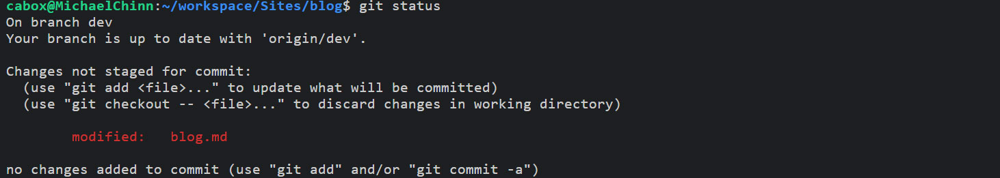
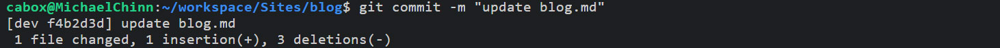
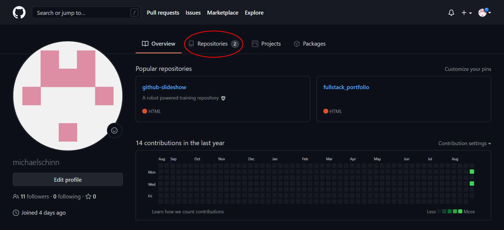
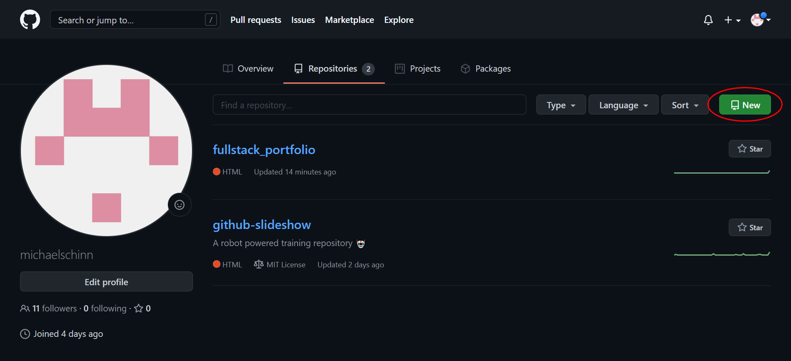
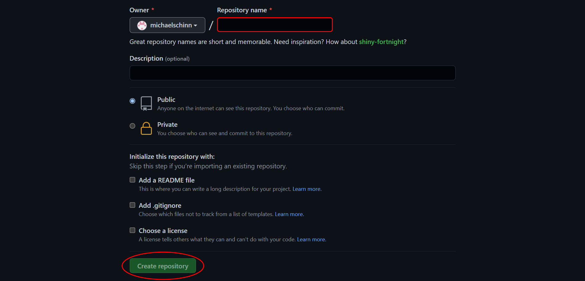
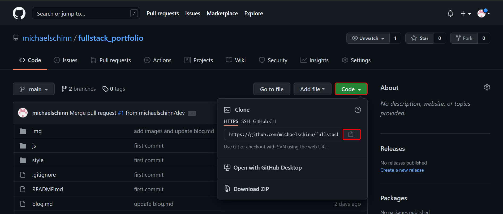
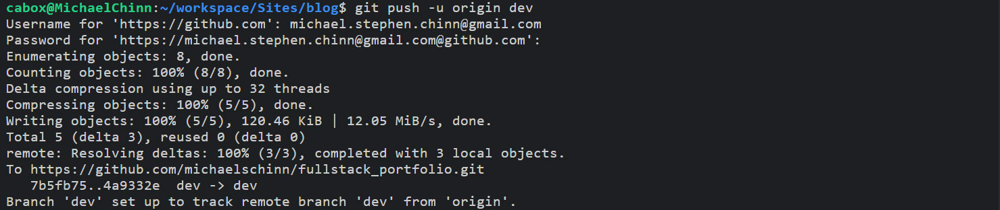
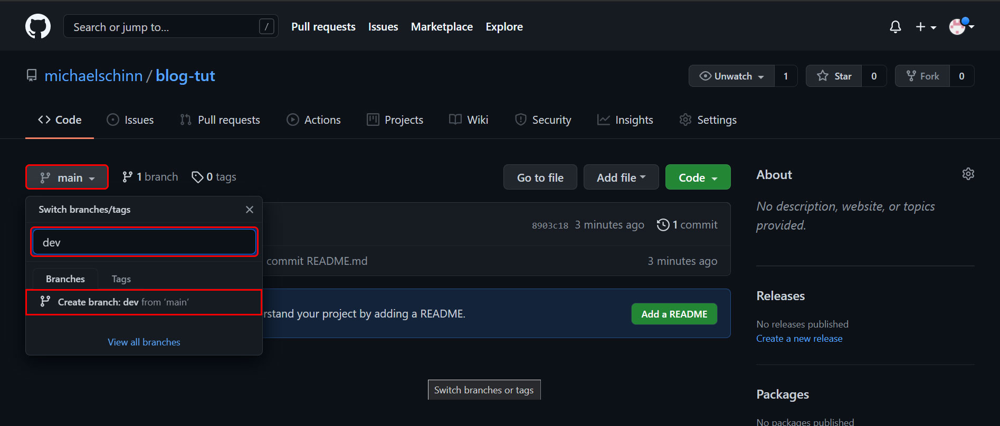
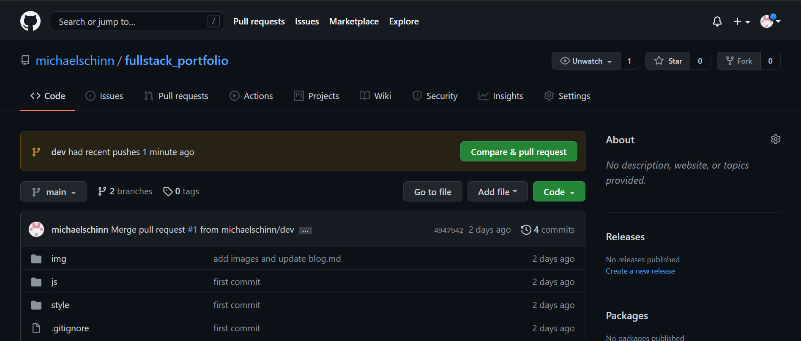

### Mike's Blog
By: Michael Chinn

---
### This is where I will be posting all of my daily / weekly progress and developments while I am attending the **Awesome Inc. Coding Bootcamp**.
<hr>
<details>
<summary>Week 5&nbsp;&nbsp;|&nbsp;&nbsp;<i>9/24/2021</i>&nbsp;&nbsp;|&nbsp;&nbsp;<b>Onboarding Overview.</b>&nbsp;&nbsp;|&nbsp;&nbsp;<i>What I got out of it. (personal)</i></summary>
<br>

<hr>

## What is the number one thing that held you back this week? Why?
The number one thing that held me back this week was time management.

We had three projects this week and I was only able to finish one of them, the blog design. I focused on it because I felt that it was the most important, as well as it was the project that I was most familiar with. I should have allocated enough time to get a minimum viable product out for each of the three projects.

I have to say, though I could have done better at managing my time, the time I spent learning the ins-and-outs if bootstrap will prove invaluable for the future of me laying out and rapidly prototyping projects. Though I took a "loss" for the week, I feel like I have a new tool to utilize in the future that will lead to many "wins".

Next week I will manage my time and efforts better so that I can complete all of my projects. I need to remember that no project will ever be "perfect" so I need to fulfill the requirements of it and move on to the next.

## What is one thing you would like to learn more about regarding JavaScript (JSON, Data Structures), Bootstrap, or Atomic Design?
In a word ... state. This concept of state controlling makes me very excited to learn more. Just the little bit I have seen has spawned all kinds of possibillities in my imagination. From UIs to video games, the benefits of controlling the state of your application seem endless.

I envision creating apps in which I can keep a detailed log of the history of user interactions with said app through the use of a state controller. I can see it being the linking mechanism through which we connect the front end of a system to it's back end. At the risk of being redundant I'll say it again... the benefits seem endless.

I can't wait until we delv into this concept more, so that I can better flesh out the gaps in my understanding when it comes to... state.

## How does In-Person Bootcamp compare to Remote Onboarding?
I love In-Person bootcamp... period.

Remote onboarding was an amazing process, through which, many of the foundational pieces that made the first week so successfull were laid. Even so, the expierience of working with the instructors and other bootcampers in-person created certain bonds that are hard to consolodate into words... But I will do my best to try.

The comradery that is created through this process of helping each other trudge through our individual difficulties, creates a sort of mutual reliance senario, in which, the instructors allow the bootcampers to assist each other with certain small issues, which frees them up to handle big issues. The result of this seems to be, that a sort of fellowship is created among the cohort. As well as a deep level of respect for the instructor.

That's my anecdotal expierience though. I think I will discuss this with my fellow bootcampers to see if they are perceiving the same thing, or if this is just a case of, I see what I want to see. Either way, I like what I'm seeing.

## What is your "Why"?

</details>

<hr>
<details>
<summary>Week 4&nbsp;&nbsp;|&nbsp;&nbsp;<i>9/17/2021</i>&nbsp;&nbsp;|&nbsp;&nbsp;<b>Onboarding Overview.</b>&nbsp;&nbsp;|&nbsp;&nbsp;<i>What I got out of it. (personal)</i></summary>
<br>

<hr>

## What was helpful during Onboarding working remotely?
The most helpful thing about working remotely during onboarding was the sense of freedom. Working remotely allows you to work from where ever you happen to be. The advent of cellular tethering and WiFi make it so that you can wor from almost anywhere. 

## What hindered your progress during Onboarding?
My progress was mostly hindered by me overthinking the task that was at hand. The distractions that come naturally anytime you work from home also played a role.

## How did you overcome challenges during Onboarding?
Learning pseudo code helped keep me from overthinking things. It allowed me to list out everything that needed to be done so that I could execute said list and get the MVP finished quicker.

</details>

<hr>
<details>
<summary>Week 3&nbsp;&nbsp;|&nbsp;&nbsp;<i>9/16/2021</i>&nbsp;&nbsp;|&nbsp;&nbsp;<b>Don't Overthink Things.</b>&nbsp;&nbsp;|&nbsp;&nbsp;<i>Keep it simple stupid. (personal)</i></summary>
<br>

<hr>

## What are your thoughts about the roles HTML, CSS, and JavaScript play in the process of rendering content and providing user experience?

### HTML
The role of HTML is to provide a markup system to structure and display content for web page.

```
<article>
    <h3 id='title'>Title Text</h3>
    <p>Lorem ipsum dolor sit amet, consectetur adipiscing elit.</p>
</article>
```

This stucture is the framework upon which the CSS and JavaScript will act upon.

### CSS
The role of CSS is to apply style to the elements of an HTML document.

```
:root{
    --primary-color: rgba(200, 200, 200, .75);
    --font-family-01: Arial, Helvetica, sans-serif;
    --font-size-01: 1.5rem;
}

article{
    font-family: var(--font-family-01)
    color: var(--primary-color);
}

h3{
    font-size: var(--font-size-01);
}
```
The code block above makes use of storing variables in the ```:root``` element of the DOM. They can then be called by other elements located further down the DOM tree. This makes it so that we can define a value one time and apply it multiple times. If later we want to change, for instance, the primary color all across our site, we simply change the ```--primary-color``` variable's value from ```rgba(123, 75, 200, .75)``` to ```#ffffff``` and the change will be applied globally.

### JavaScript
The role of JavaScript is to provide functionallity to the elements of an HTML page.

```
let title = document.getElementById('title');
title.addEventListener('click', () => {
    title.textContent("You clicked the title and changed it's content.")
});
```
The HTML, CSS and JavaScript all work together to create the UI/UX or User Interface / User Experience. UI/UX is key to providing your user with not only a useful web page but one that will be tailored for them to, utilize with maximum efficiency as well as being pleasing to their eyes.

## What are some objects that your blog incorporates?
My blog incorporates sections consisiting of multiple 'Title' and 'Content' elements.

## What are your thoughts on pseudo coding?
I can tell that pseudo coding will be a valuable tool for me. It will help me to keep focused on my current task because it will provide me with a structure from which I can write my application or web page. 

## What do I want to keep doing?
I want to keep stiving to learn new things and implement them into my toolkit. I love that through these projects I am learning how to do a very wide scope of things.

## What do I want to stop doing?
I want to stop overthinking the task at hand. From going outside of the scope of the project when it is not the appropriate time to do that.

## What do I want to write into my DNA and do forever?
Concentrate on getting an MVP(mimimum viable product) out before you jump into everything that you "think would be good for the project".

## What do we want to tell our "prior to Bootcamp" self?
Stay open minded and allow your creativity to flow... but don't sacrifice too much efficiency for that creativivty.

</details>
<hr>
<details>
<summary>Week 2&nbsp;&nbsp;|&nbsp;&nbsp;<i>9/3/2021</i>&nbsp;&nbsp;|&nbsp;&nbsp;<b>The path less traveled.</b>&nbsp;&nbsp;|&nbsp;&nbsp;<i>The struggle is good. (personal)</i></summary>
<br>

<hr>

## What is something you wish you could do but currently do not have the coding skills to accomplish?

I **love** retro gaming! From the Atari 2600 to the Sony Playstation 2, I love it all. One thing that I wish that I could do is take a program like [RetroArch](https://www.retroarch.com/) and create an Html front-end for it. I have a sufficient amount skill in Photoshop, HTML5 and CSS3 to do it. Provided I have the time I could create some very nice transitions and tranformations to make it really "pop". The thing that stops me from putting in all of the front-end work is the back-end. 


I would firstly need to have Retro-Arch installed on a server. Then it would need to be configured to that servers specifications. Next I would need to launch an instance of it for the user and stream the video output of the program to said user. Then I would need to receive streamed controller input from the user and feed it to their instance of the program. Last I would need to save the users progress to the server so they could continue where they left off the next time they instantiate an instance of the program. I don't know how to do any of that... but I would love to learn how.

## What are you struggling with?

Currently I am working on a stretch goal in which I take a markdown file and convert it to HTML using regular expressions. The issue I am currently having is wrapping all of the paragrapgs in `<p>` tags. At the moment it is wrapping everything in `<p>` tags. Admittantly I haven't had much time to address this problem as I have been doing my Sprint work and dealing with life. I am confident that this is just a challenge and not a blocker but if it turns into a blocker I will post a help request in our slack channel.

## How do you solve a problem? What methods do you use to help yourself get unstuck?

Firstly I will consult the instruction for the given task. Then if no resolution is found I will consult the documentation for the function/method/command that I am struggling with. If it is a logic problem I will spend some time thinking about the logic of what I am doing and try to address any logical fallacies that I may be commiting. If that yields nothing I will type a direct question into google and consult sites like [stackoverflow](https://stackoverflow.com/) and [reddit](https://www.reddit.com/). Lastly I will "phone-a-friend" and seek out someone with more expierience to learn what I can from them to resolve my issue.

</details>
<hr>
<details>
<summary>Week 1&nbsp;&nbsp;|&nbsp;&nbsp;<i>8/26/2021</i>&nbsp;&nbsp;|&nbsp;&nbsp;<b>Git Over Here!</b>&nbsp;&nbsp;|&nbsp;&nbsp;<i>My First Week at Awesome Inc. (technical)</i></summary>
<br>

<hr>
This week I began the [**Awesome Inc Coding Bootcamp**](https://www.awesomeinc.org/bootcamp) and so far I'm very impressed! I learned about an online IDE called [CodeAnywhere](https://codeanywhere.com/), which is very akin to VS Code, save that it is written entirely in javascript (very cool), as well as receiving an extensive refresher on using [GitHub](https://github.com/)!

I've used GitHub in the past when I was a front-end web developer, but never as in-depth as they are teaching me it can be utilized. As well as, I'm learning that the amount of things you can forget in 6 years is shocking.

<p align='center'>*6 years is a long time!*</p>

The focus of this article will be to detail out what I have learned in regards to Git and GitHub.

## The Process of Utilizing GitHub

- Initialize Your Local Repository.
- Check the Status of Your Local Repository.
- Create Content to be Pushed.
- Add Files to be Committed.
- Commit Your Changes.
- Create an Empty Repository on the GitHub Server.
- Setup Your Branch.
- Assign Your Origin URL
- Push Your New Content Up to The GitHub Server.
- Create a "Dev" Branch
- Make Changes, Add, Commit, Push, Wash Rinse and Repeat.
- Execute a Pull Request on Your Content.
- Merge your changes into the main branch.
<br><br>

## Initialize Your Local Repository

It's the simplest of things that make all the difference. This eight character command...

`$ git init`

...is where it all begins. With it you can "Create an empty Git repository or reinitialize an existing one." [*¹*](https://git-scm.com/docs/git-init) In short, it makes it possible to create branches, commit changes, push said changes up to the server, and so much more! None of this would be able to be done without first initializing a local repository. <hr>
###### *¹ From: [https://git-scm.com/docs/git-init](https://git-scm.com/docs/git-init)*
<hr>
<br>

## Check The Status of Your Local Repository.
It is important to be able to see the difference between what you have on your local repo and your repo on Github. To do this you will use...

`$ git status`

This is a very useful command. What it does is "Show the working tree status." [²](https://git-scm.com/docs/git-status) It allows you to see what is committed, what is yet to be committed and what needs to be added to be included in your next commit.

<p align='center'>*Git status output.*</p><hr>
###### *² From: [https://git-scm.com/docs/git-status](https://git-scm.com/docs/git-status)*
<hr>
<br>

## Create content to be pushed.
With out local repo initialized we can create some dummy content to work with. This will give us something to `add`, `commit`, and `push` to the GitHub server. To achieve this, all we need to do is enter the command...

`$ touch README.md`

With `touch` we can "change file access and modification times"[*³*](https://pubs.opengroup.org/onlinepubs/9699919799/utilities/touch.html) of a file. What makes this particularly useful, is that if we specify a file that does not exist, it will create it. We can confirm that it executed successfuly by issuing the command...

`$ ls`

This will "list directory contents"[*⁴*](https://pubs.opengroup.org/onlinepubs/9699919799/utilities/ls.html). Now that that is out of the way let's continue.<hr>
###### *³ From: [https://pubs.opengroup.org/onlinepubs/9699919799/utilities/touch.html](https://pubs.opengroup.org/onlinepubs/9699919799/utilities/touch.html)*<br>*⁴ From: [https://pubs.opengroup.org/onlinepubs/9699919799/utilities/ls.html](https://pubs.opengroup.org/onlinepubs/9699919799/utilities/ls.html)*
<hr>

## Add Files to be Committed.
Now, we will look into how to update the index with the changes we've made to the working tree. This is done with the command...

`$ git add -A`

This command allows us to "Add file contents to the index" [*⁵*](https://git-scm.com/docs/git-add). Without it Git would not know that we wanted to include the changes we've made into the next commit. The option `-A` lets Git know that we want it to look at all of the files that are indexed and add the ones that differ from the working tree *(eg. The files we've changed)*.<hr>
###### *⁵ From: [https://git-scm.com/docs/git-add](https://git-scm.com/docs/git-add)*
<hr>
<br>

## Commit Your Changes.
Okay, now that we have added our changes to the index it is time to record/commit them to the repository. This is done using the command...

`$ git commit -m "message"`

It's used to "Record changes to the repository" [*⁶*](https://git-scm.com/docs/git-commit). You can see that the `git commit` command is followed by the option `-m "message"`, this is used to enter a description of the changes that are being recorded to the repository.

<p align='center'>*Git commit output.*</p><hr>
###### *⁶ From: [https://git-scm.com/docs/git-commit](https://git-scm.com/docs/git-commit)*
<hr>
<br>

## Create an Empty Repository on The GitHub Server
When you first login to GitHub you will be on the "Overview" tab. From here you will want to navigate to the "Repository" tab.

<p align='center'>*Overview tab.*</p>
<br>
From the Repository page, click on the "New" button.

<p align='center'>*Repository tab.*</p>
<br>
Here you will give your new repository a name and select any additional options for it.

*(Note: Name is the only required field for creating a new repository.)*

With the name field filled out, you can now click the "Create repository" button.

<p align='center'>*New repository page.*</p>

And thats it! GitHub will automatically redirect you into your new repo. You can start pushing and pulling content from your development environment to your new repository!

Now we will go back to your CLI so that we can start wrapping up the setup for your new repository.
<hr>
<br>

## Setup Your Branch
Next we need to set the active branch that Git will use to the name of the branch we will be pushing our inital content up to. This is where we use the command...

`$ git branch -M main`

What the `git branch` command does is "List, create, or delete branches" [*⁷a*](https://git-scm.com/docs/git-branch). the option `-M` [*⁷b*](https://git-scm.com/docs/git-branch/#Documentation/git-branch.txt--M) is a combination of two options:
- `--move` : "Move/rename a branch and the corresponding reflog." [*⁷c*](https://git-scm.com/docs/git-branch/#Documentation/git-branch.txt--move)
- `--force` : "Reset 'branchname' to 'startpoint', even if 'branchname' exists already." [*⁷d*](https://git-scm.com/docs/git-branch/#Documentation/git-branch.txt--force)

So in essence, this will create a new branch in our development environment and sets it's name to be `main`. <hr>
###### *⁷a From: [https://git-scm.com/docs/git-branch](https://git-scm.com/docs/git-branch)*<br>*⁷b From: [https://git-scm.com/docs/git-branch/#Documentation/git-branch.txt--M](https://git-scm.com/docs/git-branch/#Documentation/git-branch.txt--M)*<br>*⁷c From: [https://git-scm.com/docs/git-branch/#Documentation/git-branch.txt--move](https://git-scm.com/docs/git-branch/#Documentation/git-branch.txt--move)*<br>*⁷d From: [https://git-scm.com/docs/git-branch/#Documentation/git-branch.txt--force](https://git-scm.com/docs/git-branch/#Documentation/git-branch.txt--force)*
<hr>
<br>

## Assign Your Origin URL
Next we need to setup which repository to track at a remote location. Specifically we want to track our new repository on GitHub. To do this we will use the command...

`$ git remote add origin URL`

With this command we can "Manage set of tracked repositories" [*⁸a*](https://git-scm.com/docs/git-remote). The `add` command will "Add a remote named 'name' for the repository at 'url'." [*⁸b*](https://git-scm.com/docs/git-remote/#Documentation/git-remote.txt-emaddem) In this case our 'name' will be `origin`, and our remote repository will be the `URL` to our repo on GitHub!.

We can easily obtain the URL by going to the "Code" tab for our repo on GitHub. Then we simple click on the green "Code" button and when the context menu drops down, we click the copy to clipboard button located next to the input field with the URL in it.

<p align='center'>*Copy repository URL*</p><hr>
###### *⁸a From: [https://git-scm.com/docs/git-remote](https://git-scm.com/docs/git-remote)*<br>*⁸b From: https://git-scm.com/docs/git-remote/#Documentation/git-remote.txt-emaddem*
<hr>

## Push Your New Content Up to The GitHub Server.
You are finally ready to populate your GitHub repo with content from your development evironment! To do this all you need to do is execute the command...

`$ git push -u origin main`

This command will "Update remote refs along with associated objects" [*⁹*](https://git-scm.com/docs/git-push). In other words, it will push all of the changes you have committed upstream (`-u`), to the `main` branch of your GitHub repository located at the URL stored in `origin`.

Your CLI will prompt you for your GitHub username and password. Once entered your changes will be pushed up to your GitHub repo!

<p align='center'>*Git push output*</p>

You can set up a SSH Key to get around having to enter your credentials in everytime you make a push. [This great video](https://www.loom.com/share/5bb573ac904640c99934b40c9961d83d) from **Awesome Inc**'s Ian Rios demonstrates how to achieve this.<hr>
###### *⁹ From: [https://git-scm.com/docs/git-push](https://git-scm.com/docs/git-push)
<hr>


## Create a Dev Branch
Now that we have some content up on the GitHub server we can create a development branch to work off of. This way we can make changes to our files and commit them to the server without affecting our main branch. This will provide a buffer for us, just in case there are any mistakes or errors in our changes. 

This is done on the GitHub website on the repository's page, under the "Code" tab. 

Once there, click on the branch dropdown button. It will be set to main by default.

Now click inside the text input box and enter in the name of our new branch, in this case "dev".

Lastly, click "Create branch dev from 'main'".



GitHub will create your new branch and redirect you to that branches page. You can verify that it successfully created your new branch by looking at the branch dropdown button. It should read "dev" now instead of "main".

## Make Changes, Add, Commit, Push, Wash Rinse and Repeat.
It is time to get used to the development cycle. To start let's add some content to our empty README.md file.
```
| Name | Date | Description |
|---|---|---|
| Michael Chinn | 8/30/2021 | This is a generic description. |
```
The output for this block of text will be this.
| Name | Date | Description |
|---|---|---|
| Michael Chinn | 8/30/2021 | This is a generic description. |

Now that we've made some changes its time to execute commands we have already touched upon.

`$ git add -A`

`$ git commit -m "Updated README.md"`

`$ git push -u origin dev`

Enter your username and password and that's it! You will just repeat this process of `add`, `commit`, and `push` until you are satisfied with all of the changes you have made.

Next we shall dive into the process of taking the work performed in your dev branch and getting it to the main branch.

## Execute a Pull Request on Your Content.
Now that we have pushed our content up to GitHub, we can create a pull request. With the pull request we can "Fetch from and integrate with another repository or a local branch" [*¹⁰*](https://git-scm.com/docs/git-pull). In other words you will pull the content from your dev branch to your main branch. This is done from the GitHub website.

From here we can click on the compare an pull request button.

<p align="center">*GitHub pull request.*</p>

## Merge Your Changes Into the Main Branch.

What's really **Awesome** is that in the past, I never learned to use the GitHub website beyond cloning repos and viewing files. The majority of my experience with it was through a CLI, so it was a real treat to learn the ins and outs of it.

I thank God that I have access to all of the knowledge and experience of the instructors. I can tell that the Bootcamp is going to be a real game changer for me. :)
</details>
<hr>